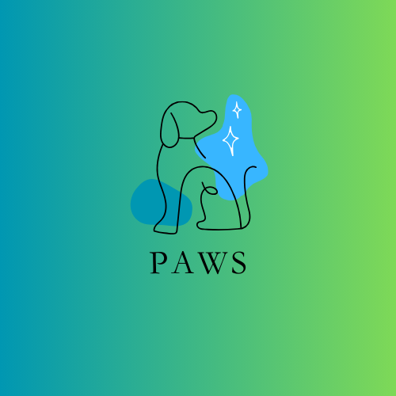

<h1 align="center">PAWS</h1>
<h3 align="center">"Pause To Save Paws"</h3>

  
  

About the project:

     
    
    
    
    <!--  -->

 

Tech Stack:

     
    
    
    

:

## Inspiration for the Project:

Our project, **Paws**, is driven by a deep concern for animal welfare. Witnessing the challenges faced by animals worldwide, we were inspired to create a platform that enables users to report injured animals and connect them with the necessary assistance. Through **Paws**, we aim to raise awareness, foster compassion, and make a positive impact in the lives of animals in need.

**Paws** was developed during the Smart Bengal Hackathon 2024 and proudly emerged as one of the finalist apps. This recognition further fuels our commitment to advancing animal welfare and leveraging technology for social good.
## Features of Paws at a Glance

| Function | Feature | Image |
| --- | ----------- | -------|
| Adopting a Pet | Allows user to choose an animal they wish to adopt and submit their details for contact purposes |   |
| Donating a Pet | Pet owners can donate their pets if they are unable to take care of the ones they have |  |
| Emergency care for Stray Animals | Provide contact details to get emergency medical services |  |
| Support PetMe | Allows users to become volunteers for PetMe and submit their details for contact purposes |  |
| Pet News | PetMe provides users with several stories on the latest news in the pet world |  |
| Blogs | PetMe also has a blogs section dedicated to pet lovers and their pet stories |  |
----

Additional features:

i will fill this 

## Contributing 👨‍💻 
### Check Out   [CONTRIBUTING.md](/Contribution.md)

##  Project Maintainers ✨

<table>
  <tr>
<td align="center"><a href="https://github.com/shreyashaw05"> <b>Shreya  </b></a></td>

<td align="center"><a href="https://github.com/codewarnab"> <b>Arnab</b></a></td>
 
<td align="center"><a href="https://github.com/rishicds"> <b>Rishi</b></a></td>

<td align="center"><a href="https://github.com/anirbanmajumder0"> <b>Anirban</b></a></td>
  
<td align="center"><a href="https://github.com/debayudh07"> <b>Debayudh</b></a></td>
  
 </tr>
</table>

## License 🛡️ 

PetMe is licensed under the MIT License - see the [LICENSE](LICENSE) file for details.

## Socials 

i will add this soon 
